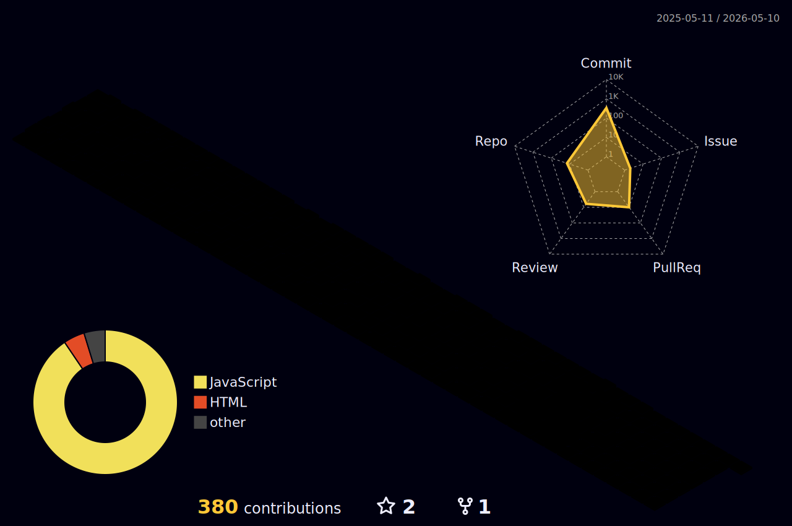

  

  

    
  

  <h3>🚀 Mobile Engineer | React Native • Kotlin • Swift • Flutter</h3>
  
<i>Building seamless cross-platform experiences with high-performance code.</i>

---

### 📊 Engineering Stats

  
  

---

### 🛠️ Mobile Tech Stack

  
  
  
   
  
  
  
  

---

### 🏙️ 3D Contribution Architecture

  

---

### 🎵 On My Playlist (YouTube Music)

  
  
Currently vibing to Lo-Fi beats & Afrobeat while coding.

---

### 🐍 Contribution Activity

  

  

