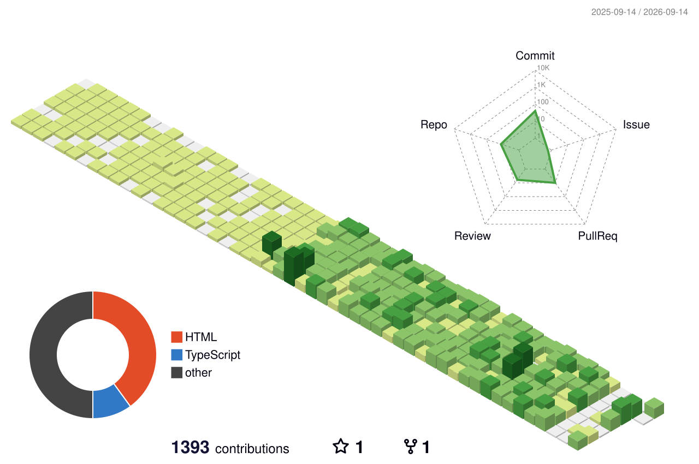

<div align="center">

<!-- Animated Header -->


<!-- Typing Animation -->
<a href="https://git.io/typing-svg">
  
</a>

<br/>

<!-- Social Badges -->
<p>
  <a href="https://github.com/joshuapetertolu">
    
  </a>
  &nbsp;
  
</p>

</div>

---


## 🧑‍💻 About Me

```typescript
const joshua = {
  role: "Mobile Engineer",
  location: "🌍 Building from Anywhere",
  stack: ["React Native", "Expo", "TypeScript", "Flutter", "Swift"],
  currentlyLearning: ["AI-powered mobile UX", "SwiftUI", "Rust"],
  passions: ["Performance tuning", "Clean architecture", "Great UX"],
  funFact: "I ship mobile apps and Lo-Fi beats fuel every line of code 🎵",
  motto: "Make it work. Make it fast. Make it beautiful."
};
` ` `


---

## 🛠️ Mobile Arsenal

<div align="center">

### 📱 Core Stack
<p>
  
  
  
  
  
</p>

### ⚡ Also in my toolkit
<p>
  
  
  
  
  
  
</p>

### 🧪 Testing & CI/CD
<p>
  
  
  
  
</p>

</div>

---


## 📊 GitHub Stats

<div align="center">
  
  
</div>

<div align="center">
  
  
</div>

---

## 🏆 Achievements

<div align="center">
  
</div>

<p align="center">
  
  
  
</p>

---

## 🏙️ 3D Contribution Architecture

<div align="center">
  
</div>

---

## 🐍 Watch the Snake Eat My Commits

<div align="center">

<sub>Every square it devours = a day I shipped something. The grid never lies 👀</sub>

<br/><br/>

<!-- Auto-switches between light & dark snake based on the viewer's GitHub theme -->
<picture>
  <source
    media="(prefers-color-scheme: dark)"
    srcset="https://raw.githubusercontent.com/joshuapetertolu/joshuapetertolu/output/github-contribution-grid-snake-dark.svg"
  />
  <source
    media="(prefers-color-scheme: light)"
    srcset="https://raw.githubusercontent.com/joshuapetertolu/joshuapetertolu/output/github-contribution-grid-snake.svg"
  />
  
</picture>

<br/>

<!-- Commit legend -->
<p>
  
  
  
  
  
</p>

> *"Feed the snake. Commit every day."* 🎯

</div>

---

## 📈 Contribution Graph

<div align="center">
  
</div>

---

## 🎵 Currently Vibing To

<div align="center">

  > *"Lo-Fi beats + Afrobeat = peak engineering flow state"* 🎧

  <a href="https://music.youtube.com">
    
  </a>
  <a href="https://open.spotify.com">
    
  </a>

</div>

---

<div align="center">

### 💬 Let's Connect & Build Something Great

<p>
  <a href="https://github.com/joshuapetertolu">
    
  </a>
  <!-- <a href="https://linkedin.com/in/YOUR_HANDLE"></a> -->
  <!-- <a href="https://twitter.com/YOUR_HANDLE"></a> -->
</p>


</div>
